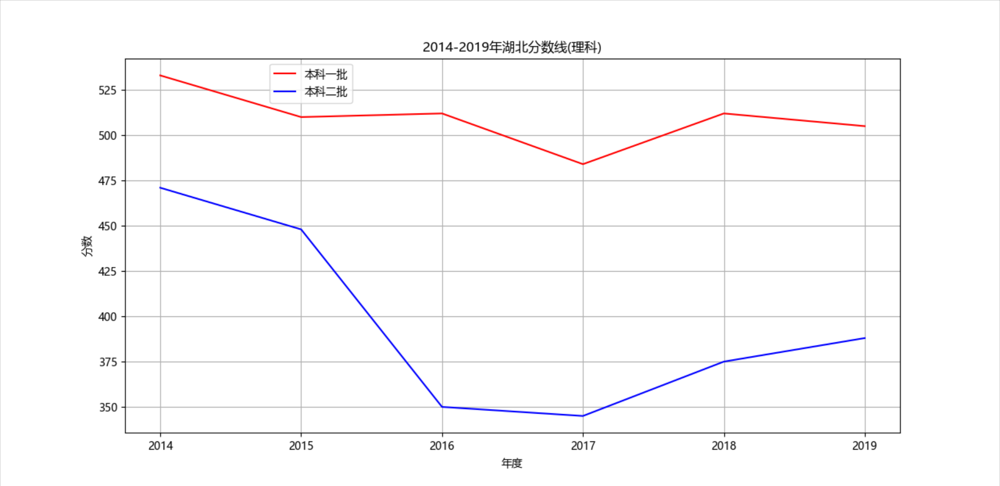
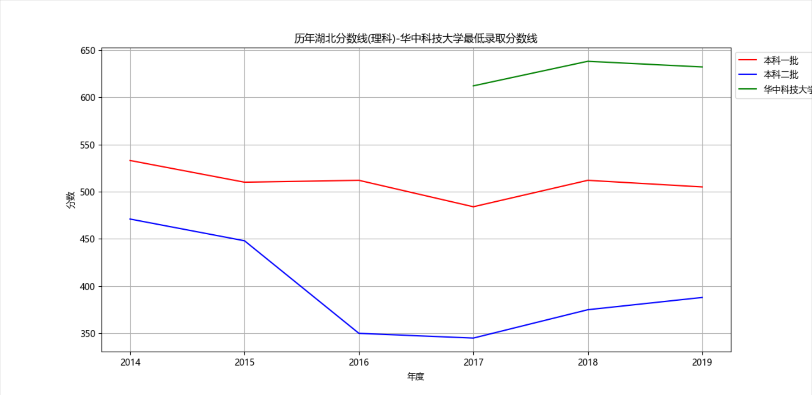

# scoreLine
高考分数线查看器。

## 运行
1. 安装依赖
    ```
    pip install requests
    pip install sqlite3
    pip install matplotlib
    ```
2. 修改参数
    ```
    // 查询地
    provinceName = '湖北'
    // 科目类型
    typeName = '文科'
    ```
3. 运行
    ```
    python ./main.py
    ```
4. 运行结果
    
    

## 说明
1. 参数需要遵循规则，例如：`湖北`不要写成`湖北省`。
2. 暂时只支持`理科`，`文科`两个科目。